# Myntra StyleVerse: Your AI-Powered Fashion & Decor Companion  🛍️✨


An innovative solution for the **Myntra "HackerRamp WeForShe" hackathon**, designed to bring the experience of a personal stylist to every user's fingertips. Using cutting-edge Generative AI, Computer Vision, and multi-modal search, our mission is to make online shopping deeply personal, intuitive, and confidence-boosting.

---

## 🚀 Live Demo

The project is deployed and live on Render. You can view it here:

[](https://myntra-project-3.onrender.com)

---

## 🚀 Demo Video

Check out this quick video to see Myntra StyleVerse in action!

[![Myntra StyleVerse Demo Video]](https://drive.google.com/drive/folders/1V58k-_K-Oq-seb-7wou0gVRbS8F6pudf?usp=drive_link)

---
## 🚀 Key Features

### 👗 1. AI Look Curator
Simply tell our AI stylist what you're looking for, and it will create the perfect ensemble for you. From a "Traditional pooja look" to a "casual brunch outfit," get a complete, curated look with matching dresses, footwear, and accessories, all available on Myntra.

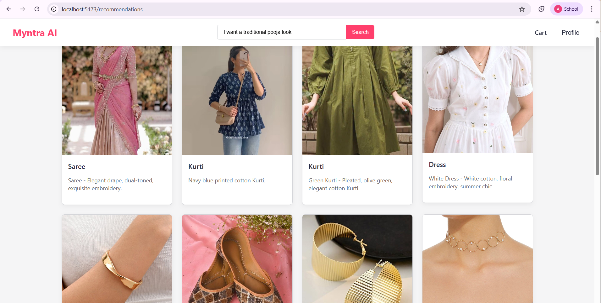

---

### 🖼️ 2. Visual "What to Wear" Assistant
Leverage the clothes you already own! Upload an image of an item from your wardrobe and ask, "What should I wear with this?". Using vector search and image embeddings, our assistant recommends complementary items from Myntra's catalog to complete your look.

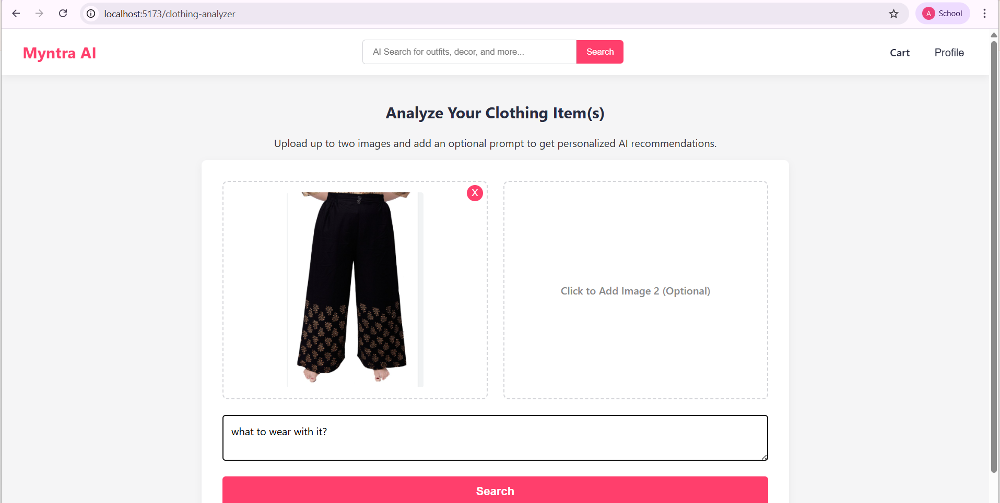
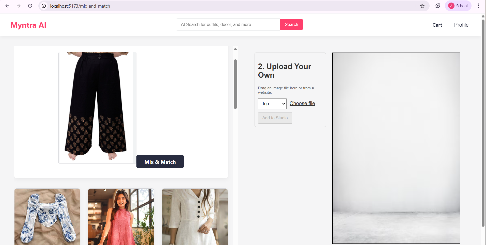

---

### 👕👖 3. Virtual Mix & Match Studio
Become your own stylist in our interactive studio. Drag and drop items you like, and our AI model, using **Clothing Co-Parsing**, instantly isolates the clothing item from its background. Freely mix and match tops, bottoms, and accessories to create and visualize unique outfits in real-time.
Users can upload clothes from there own ends and try mix&match.

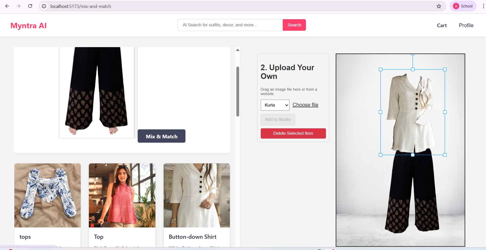
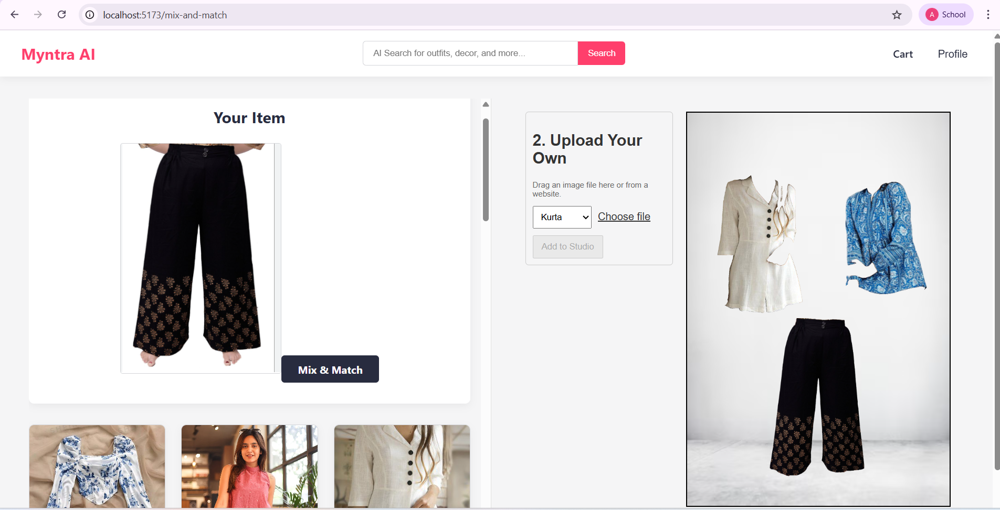


---

### 🏠 4. AI Home Decor Stylist
Our styling expertise doesn't stop at fashion! Upload a picture of a corner in your house, a table, or an empty wall. Our AI analyzes the space's aesthetic and suggests suitable decor items like wall hangings, vases, or furniture to complete your home.

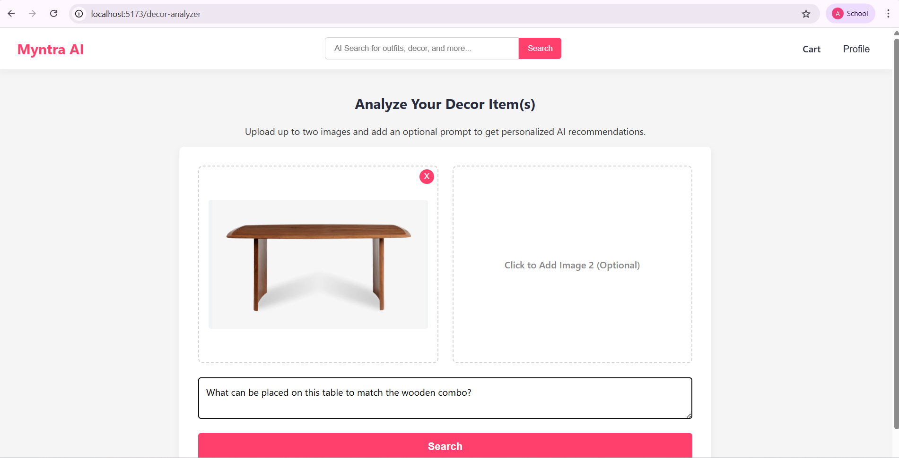
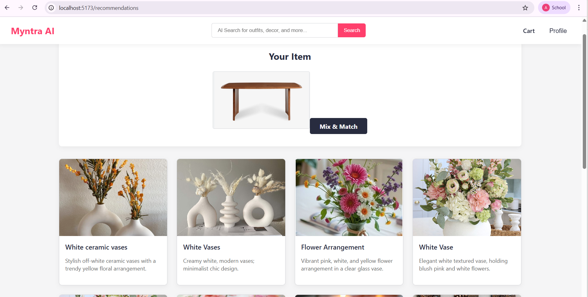


---

### 🏆 5. Community Style Contests
Share your creativity and get recognized! Post the unique looks you create in the Mix & Match Studio for the community to browse and "like." Top-voted creations earn stars, which can be redeemed for gifts and vouchers, fostering a vibrant and engaged user community.

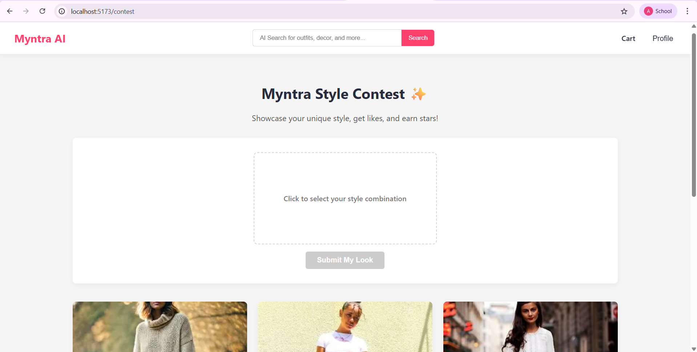
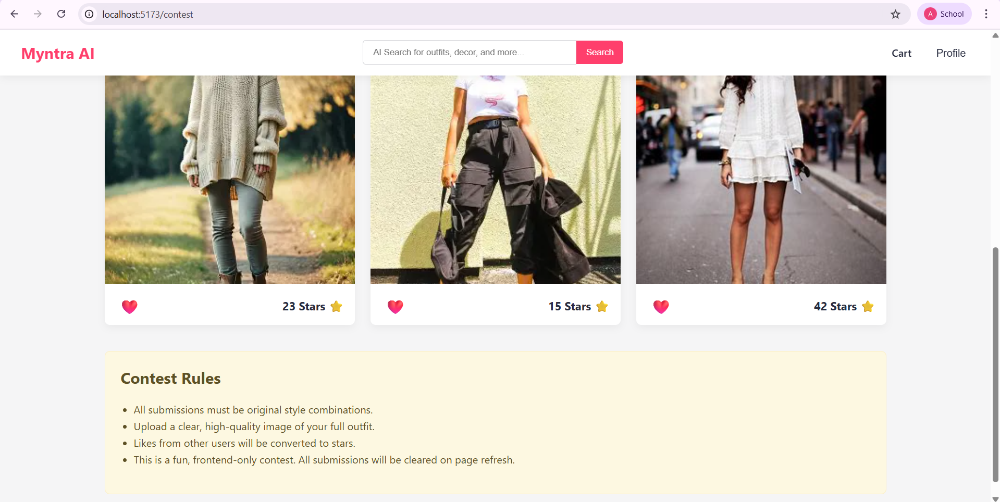


---

### 🛒 6. Smart Cart Stylist
Get more value out of every purchase. Our AI analyzes the items in your cart and provides creative suggestions on how to style each item for multiple occasions, such as taking a shirt from a formal office look to a casual weekend outing.

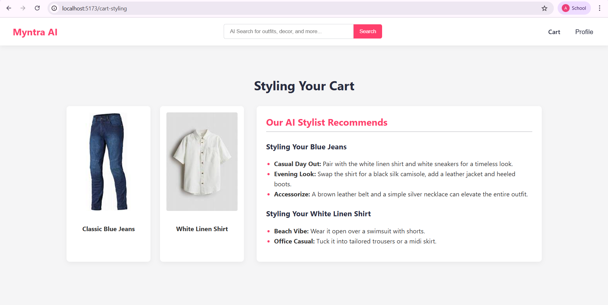


---
## 🚀 Getting Started

1.  **Clone the repo**
2.  **Install backend dependencies**
    ```sh
    cd backend
    npm i
    npm run dev
    ```
3.  **Install frontend dependencies**
    ```sh
    cd frontend
    npm install
    npm run dev
    ```
4.  **Run the embedding-service**
    ```sh
    python -m venv venv
    .\venv\Scripts\activate
    uvicorn main:app --reload
    ```
5. **Run the Clothing Co-Parsing**
   ```sh
     python -m venv venv
    .\venv\Scripts\activate
     python app.py
   ```
   ## 🧠 Pre-trained Model

This project requires the pre-trained weights for the Clothing Co-Parsing model. Please download the `.pth` file from the link below and place it in the `Clothing Co-Parsing` directory of your project.

[](https://drive.google.com/file/d/1d6Q_YBHurmwAHo_jUuR-Fr18vsuJPoYe/view?usp=sharing)

---
## 🏗️ System Architecture

Our Myntra StyleVerse platform is built on a robust and scalable architecture, leveraging a blend of AI services and modern web technologies to deliver a seamless user experience. The diagram below illustrates the core components and data flow:

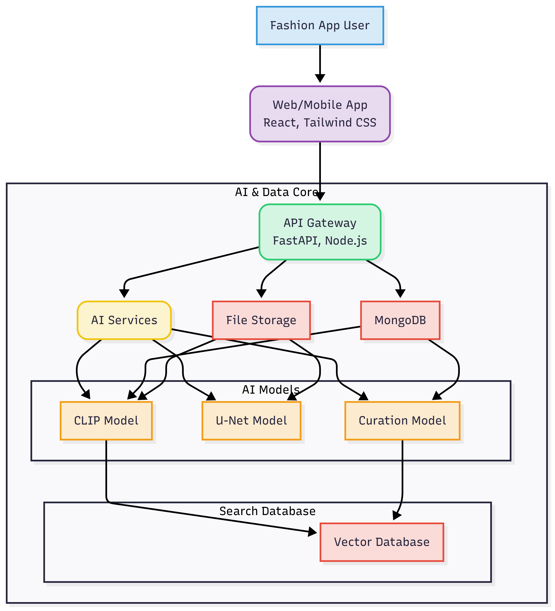

### Architecture Overview:

* **Fashion App User:** Interacts with the platform via the Web/Mobile App.
* **Web/Mobile App:** Built with `React` for web ,styled with `Tailwind CSS` for a responsive UI.
* **AI & Data Core:**
    * **API Gateway:** Manages all incoming requests, built using `FastAPI` (Python) for AI/ML heavy tasks and `Node.js` for other backend services.
    * **AI Services:** House of the core logic for processing user requests and interacting with AI models.
    * **File Storage:** Stores user-uploaded images.
    * **MongoDB:** Used for storing product database catalog.
    * **AI Models:**
        * **CLIP Model:** Utilized for multi-modal embeddings (image-text understanding) for visual search and content recommendations.
        * **U-Net Model:** Employed for image segmentation tasks, such as isolating clothing items in the Virtual Mix & Match Studio.
        * **Curation Model:** Powers the AI Look Curator and Smart Cart Stylist, generating outfit suggestions and styling tips.
    * **Search Database:**
        * **Vector Database:** Stores high-dimensional vector embeddings enabling efficient semantic search and similarity matching for product recommendations and visual search.

---
## 🛠️ Technology Stack

| Category          | Technologies Used                                                              |
| ----------------- | ------------------------------------------------------------------------------ |
| **AI / ML** | `Python`, `TensorFlow`/`PyTorch`, `Hugging Face`, `CLIP`, `U-Net`, `Vector DB`     |
| **Backend** | `FastAPI`, `Node.js`, `Express.js`                                             |
| **Frontend** | `React`,`tailwind`,`CSS`,`JS`               |
| **Database** | `MongoDB`                                   |

---

## 👥 Contributors

| Name             | GitHub Profile                                                 |
| ---------------- | -------------------------------------------------------------- |
| Vanshika Singla  | [@vanshikasingla220705](https://github.com/vanshikasingla220705) |
| Akshita Kumari   | [@Akshitakumari156](https://github.com/Akshitakumari156)         |


---
